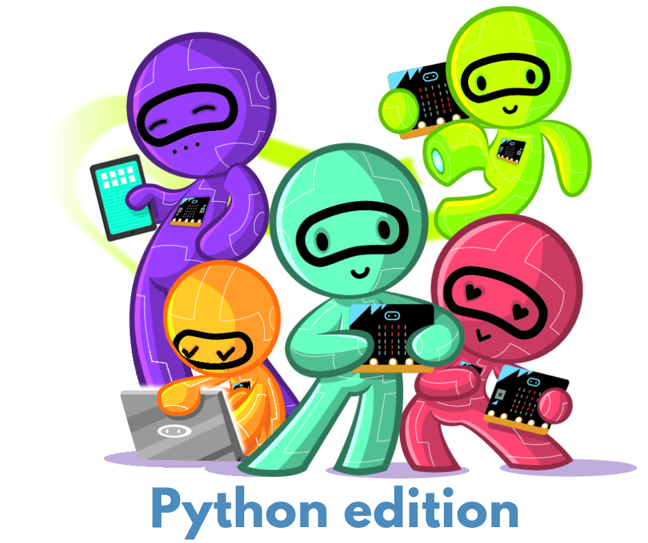

Preface
=======

About the book
------------------------------------

This book is the Python edition of the "Networking with Micro:bit Book", 
and presents a series of activities to teach the basics of computer networks. 
Each chapter introduces exciting challenges in radio communication and networking with micro:bits.
After every few chapters, there's an exciting game to look forward to!

In this version of the book, you will use MicroPython for programming your micro:bits. For
this, you can use either use the  Python Editor at the Microbit Educational Website 
([python.microbit.org](https://python.microbit.org/)), the Mu editor
([https://codewith.mu/](https://codewith.mu/)), or the [MicroPython IDE for
VSCode](https://marketplace.visualstudio.com/items?itemName=dphans.micropython-ide-vscode).

Writing this book, we have assumed no knowledge of radio communications or networking. 
However, we expect that you have written programs for the micro:bit. To be able to do the activities in
this book, it will help to be familiar with variables, if-then-else statements, and loops. 
The activities in each chapter will provide ample opportunity to put your programming knowledge into practice.

Understanding how computers talk to each other is something that we think is important, 
which is why we wrote this book. We've enjoyed designing the tasks and challenges in the book, and we hope you do too.

Editions
--------
The online edition of the Makecode version of this book is available from the Nominet Research's website at [https://microbit.nominetresearch.uk/networking-book-online/](https://microbit.nominetresearch.uk/networking-book-online/).
A PDF version of the same book is available for [download](https://microbit.nominetresearch.uk/networking-book-pdf/networking_with_the_microbit.pdf).
You can get also buy a printed copy from [Amazon.co.uk](https://www.amazon.co.uk/Networking-micro-bit-Anthony-Kirby/dp/1973396769) or [Amazon.com](https://www.amazon.com/Networking-micro-bit-Anthony-Kirby/dp/1973396769) (this is the cheapest & most efficient way for us to make printed copies available).

About the authors
-----------------

"Networking with the Micro:bit" book was created by two researchers, Cigdem Sengul and Anthony Kirby.
To create the Python version of this book, Jonathan Grout worked with Cigdem Sengul to carefully convert all activities to their 
Micropython versions. 

This book was made possible by Nominet, the .uk DNS registry. As a domain registry, Nominet runs the part of the Internet that controls how names like
[http://www.bbc.co.uk](http://www.bbc.co.uk) are used over the Internet, when people, computers, or devices like tablets or smartphones try to connect to them.

Outline
-------

- [**Connecting micro:bits with wires**](wiredcommunication/wiredcommunication.md)  
    This chapter is a fun demonstration of networking over wires.

- [**Broadcast communication: One-to-all**](broadcast/broadcast.md)  
    You will start using radio communication in this chapter and learn about broadcast communication. 
    Broadcasting  means one micro:bit will send messages to many other micro:bits. However, be
    cautious! If all micro:bits do that, it’s like everyone is speaking at once.

- [**Group communication: One-to-many**](groupcommunication/groupcommunication.md)
    In this chapter, you will form small groups to send to and receive from a limited number of micro:bits. 
    Here, selecting a unique identifier for your group will be an exciting challenge.

- [**Game 1: Shakey Donkey**](shakeydonkey/shakeydonkey.md)
    This is a game that uses the micro:bit radio. See whether you can figure out how to play the game and how it works.

- [**Unicast Communication: One-to-One**](unicast/unicast.md)
    Broadcast and group communication are fun. However, sometimes you want to talk to only one person. This is called unicast communication. To do this, you will discover that you need a unique identifier
    for your micro:bit.

- [**Two-way Unicast**](twowayunicast/twowayunicast.md)
    It's no use talking with somebody if you don't get a response back. 
    In this chapter, you will program your micro:bit to send a message and to get a reply. 
    Also, you will work out how long it takes for a response to come back. 
    Doing this, you will also program one of the most important tools used on the
    Internet: Ping.

- [**Game 2: Rock-Paper-Scissors over Radio**](rockpaperscissors/rockpaperscissors.md)  
    You will program the traditional Rock-Paper-Scissors game but to work over the radio, so that you can play remotely with your friends.

- [**Handling errors: Retransmissions**](retransmissions/retransmissions.md)
    Nothing is perfect, not even radio communication. What happens if
    your message gets lost on the way? In this chapter, you will test
    methods for dealing with message loss using retransmissions.

- [**Handling errors: Acknowledgements**](acknowledgements/acknowledgements.md)
    It's a waste to retransmit if the other side already received the message! 
    The receiver needs a reply (or an acknowledgement) to avoid this. 
    At the sending side, if you do not receive an acknowledgement, you can assume that your message wasn't received. 
    In this chapter, you will test how well acknowledgements work to improve reliability.

- [**Game 3: Battleship over Radio**](battleship/battleship.md)
    You have come far. Now you are ready for another classic game!
    You will write a version of the famous Battleship game using
    your micro:bits. Your experience with radio communication and
    networking will help you along the way.

- [**Game 4: Reaction Game**](reactiongame/reactiongame.md)
    This is the game that Jonathan Grout came up with when we worked on this Python edition.
    The Reaction Game is a simple two-player game inspired by the popular toy Bop It[^1]. The game 
    tests your reaction time against an opponent by performing
    actions that the micro:bit tells you to do. Radio communication will help you and your opponent
    coordinate your game turns.

Let's start!

[^1]: Bop It in Wikipedia: [https://en.wikipedia.org/wiki/Bop_It](https://en.wikipedia.org/wiki/Bop_It)
