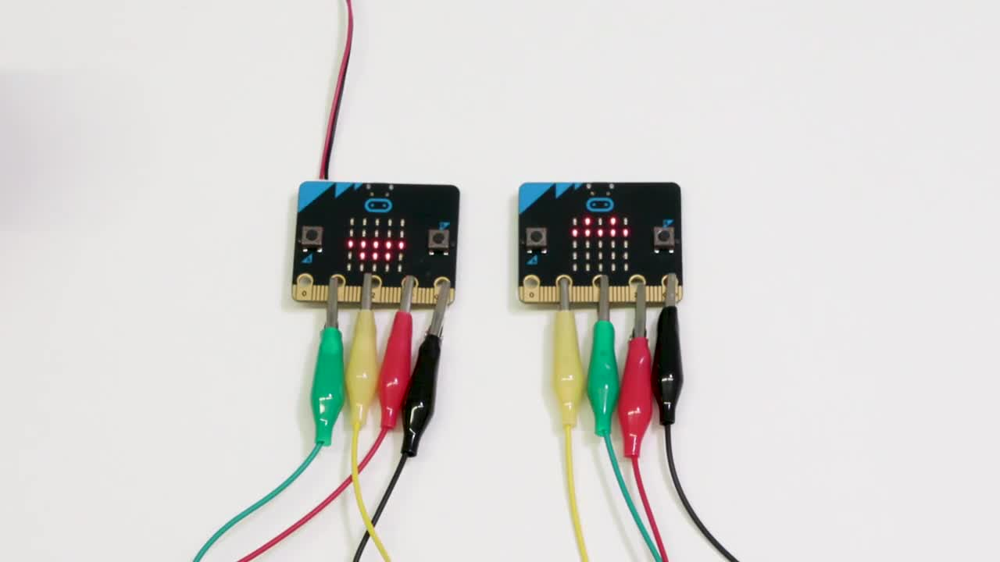

Communication over Wires
========================


Introduction
------------

Everything is connected nowadays! Computers and devices connect to each other to form networks. And these networks connect to
form the Internet. When we say *computers* or *devices*, these
can be anything from a traditional laptop to a cellphone, to a washing machine, to a humidity sensor. Of course, it can also be
your micro:bit. More and more, the Internet is becoming an *Internet of Things*.

In this chapter, you will form your own network using wires to
connect two micro:bits. Doing this, you will learn:

- the concept of a *communications medium*, and *signals*

- the concept of *binary* and *bit*

- the concept of a *network*

### What will you need?

    2 micro:bits
    4 crocodile clip leads
    1 battery holder, and 2 AAA batteries
    1 teammate

Background
----------

For two micro:bits to be able to send messages to each other, they
somehow need to be connected, whether by wires or wirelessly - we call this a *communications medium*.

A message could be a string like “Hello”, a number like “9”, or an icon image. The micro:bits convert each message to a signal to send it over the *communications medium*.

!!! hint "Definition 1: _Communications medium_"
	A communication medium is the physical path over which a signal is transmitted.

!!! hint "Definition 2: _Signal_"
	Signals are the electromagnetic voltages or waves transmitted
	on a physical wired or wireless medium.

For example, take the case when we say “Hello” into a landline
telephone. The telephone handset converts the sounds into an
electrical voltage signal. Then, this signal is transmitted to the
receiving telephone by wires; and at the receiver, it is converted back into sound.

So, that is an example of wired communication. 
Then, what is the wireless physical medium that makes radio communication possible?

Computers, and also your micro:bit, cannot process signals without
converting them to binary data: 0s and 1s. Also, the binary data
processed by computers need to be converted into signals before they can travel a communication medium.

!!! hint "Definition 3: _Bit_"
	A bit is the smallest unit of data in a computer. It is like an
	atom. A bit can be either a 1 or a 0.

A group of 8 bits is a *byte*. Table \[tab:bit\] shows other example
groupings.

|**Name** | **Size**|
|---------|:--------|
|Byte (B) | 8 bits |
|Kilobyte (KB) | 1024 bytes |
|Megabyte (MB) | 1024 kilobytes |
| Gigabyte (GB) | 1024 megabytes |
| Terabyte (TB) | 1024 gigabytes |

By connecting computers or any device through different communications
mediums, we create networks.

!!! hint "Definition 4: _Network_"
	A computer network is a collection of computers or devices,
	which are connected to communicate with each other. In a computer
	network, there are at least two computers. Two or more networks can
	connect to form a larger network: a network of networks. Internet is a massive network of networks!

In this chapter, you will create a network of two micro:bits, connected via wires.

Programming: A Simple Heart Transfer
------------------------------------

In this section, you will learn how to connect two micro:bits via wires, and then
send a *Heart* icon from one micro:bit to another.
The figure below shows how a heart icon should look like on the
micro:bit display [^1].


!!! note ""
	**Figure 1:** Micro:bit displaying a heart icon

This activity is best done with a teammate. In the following, you will go through two tasks to program your micro:bits.

### Task 1: Connect your micro:bits and test telegraph

**Description:** You will connect your micro:bits using wires, and use
a program to check the connections. You can follow the instructions below, or there are more detailed step-by-step instructions in the *Micro-bit telegraph activity*[^2] on the micro:bit website. We also created a video to show how your connections
and program should work in this activity.
See the video at [Simple Heart Transfer](https://microbit.nominetresearch.uk/networking-book/simple_heart_transfer.html).

**Instruction:**  Using crocodile clips, connect the 3V pin between the two micro:bits, and connect the GND pins. Then connect pin 1 on one micro:bit to pin 2, and vice-versa.  Be careful to get the crocodile clip connections right: two of the wires connect straight (3V-to-3V and GND-to-GND) but the other two cross over (1-to-2
and 2-to-1).

See the figure showing connections for an example, and look at the colours carefully. You don’t need to use the same colours, of course, but they must make the same connections.


!!! note ""
	**Figure 2:** Wiring micro:bits. Two of the wires connect straight
	(3V-to-3V and GND-to-GND) but the other two cross over (1-to-2 and 2-to-1)

To test, use the program from the figure showing the Telegraph program; press button A on each micro:bit and check that the LED illuminates on the other one.

```python
signal = None
while True: 
	if button_a.is_pressed():
		pin1.write_digital(1)
		sleep(100)
		pin1.write_digital(0)

	signal = pin2.read_digital()
	if signal == 1:
		display.set_pixel(2,2,9)
	else: 
		display.set_pixel(2,2,0)
```
!!! note ""
	**Figure 3:** Telegraph program. Pressing button A sends a signal to the other side using Pin 1. The receiver micro:bit listens on Pin 2 to check if a signal is received. If there is a signal, it lights up the (2,2) pixel on the display.

### Task 2: Program a simple heart transfer

**Description:** In this task, you will write a program so that when one micro:bit tilts over another, it "transfers" a heart icon to that micro:bit. To do this task, you will need to think about the following questions:

1. Which input will the micro:bits react to in your program?

2. How do the micro:bits send data to each other?

3. **Hint: Do you think they should be sending each other the Heart
    icon as a whole?**

**Instruction:** For question 1, look at the [Gestures section in the BBC Micro:bit MicroPython
documentation](https://microbit-micropython.readthedocs.io/en/latest/tutorials/gestures.html). For question 2, use the example Telegraph program above. For question 3, here is another big hint. **Hint: Assume micro:bits knows that they will be transferring a Heart icon between them.**

Let's consider two micro:bits side by side. We will call the micro:bit on the left "Left Micro:bit", and the micro:bit on the right "Right Micro:bit:
Program your Left Micro:bit so that:

1. It displays a heart icon until it is tilted over the Right Micro:bit.

2. When tilted over the Right Micro:bit, it sends a pulse to it over the correct pin.

3. When the Left Micro:bit receives a pulse on its correct pin, it displays a heart icon.

Program your Right Micro:bit so that:

1. It displays a heart icon when it receives a pulse on its correct pin.

2. When tilted over the Left Micro:bit, it sends a pulse to the Right Micro:bit over the correct pin.

Note that the programs that you write for your micro:bits will be symmetric.

Programming: Transfer any icon bit by bit
------------------------------------------



!!! note ""
	**Figure 4:** Bit-by-bit heart transfer. Left Micro:bit, our sender, could have sent any icon with this method.

	Start this activity by watching the [Wired\_pixel\_by\_pixel\_heart.m4v](https://microbit.nominetresearch.uk/networking-book/pixel_heart_transfer.html). Notice that the icon image is made up of 5x5 pixels, and each pixel is either on or off. So, when the button A is pressed, the Left Micro:bit sends pixel state at each location to the Right Micro:bit. On receiving this state, the Right Micro:bit lights up the correct LED on its display, achieving a bit-by-bit image transfer. The figure and the video show the bit-by-bit transfer of a Heart icon, but you can transfer any image with this method.

### Task 1: Program the Left Micro:bit as the sender

**Description:** In this task, you will write a program for the sender. The sender will be your Left Micro:bit. On pressing button A, the sender displays the icon to send and then signals the state of each pixel location to the receiver, the Right Micro:bit. It turns off the LED corresponding to the pixel sent.
To do this task, you will need to think about the following questions:

1. How do you represent the icon image as 1s and 0s? 1 means the LED state is on, and 0 means the LED state is off.
2. On pressing the button A, the sender should start sending the icon image. How do you decide which bit to send?
3. If the bit to send is a 1, how do you signal this to the receiver? If the bit to send is a 0, how do you signal this to the receiver? 

**Instruction:** Program your micro:bit, so it sends an image icon bit-by-bit answering the questions above.  The most tricky bit is question 3, which is a fundamental concept in digital communications. You may find several methods if you research "Line Coding". Get inspiration from them, but we suggest that you keep the idea of transitioning pin1 from 1 to 0, as you did in the previous exercise. Receiving that transition signals to the receiver that it is receiving data from the sender. Now, you can send a long signal (keep pin1 on 1 for a long time) to send a 1, and a short signal to send a 0 (keep pin1 on 1 for a short time). This way, the receiver can differentiate separate 1s and 0s.  


!!! note ""
	**Figure 5:** Sending 1001 with the method explained below. 1's are sent as longer signals, and 0's are sent as shorter signals.

### Task 2: Program the Right Micro:bit as the receiver

**Description:** In this task, you will write a program for the receiver. The receiver will be your Right Micro:bit. On the receiver side, you will keep reading pin2 to understand whether you are receiving a signal or not. Based on the signal you received, you will decide which LED to turn on or keep off. At the receiver side, pressing button A clears the display.

To do this task, you will need to think about the following questions:

1. How do you detect whether you are receiving a data signal?
2. How do you decide whether received data is for a 1 or a 0?
3. How do you decide which pixel to turn on or keep off based on the received data?

**Instruction:** Program your micro:bit, so it receives an image icon bit-by-bit, turning on the corresponding LED on its display.  The most tricky bit is question 2,
and the receiving micro:bit needs to know what method the sender is using to send 1s and 0s. So, in our case, the receiver needs to check whether it is receiving a long signal or a short signal. You
will need the `running_time()` function to calculate the duration of signals. This function returns the number of milliseconds since the micro:bit was last switched on. To calculate the length of the signal, you will need to record the time difference between receiving a 1 and a 0 at pin2. If this time is higher than a threshold value, you must have received a 1. If this time is short, you must have received a 0. **Hint: You do not need to match exact signal times. Just check whether the signal is longer than a threshold value to be accepted as a 1.**

Now that you have sender and receiver programmed test your code with different icons.

**Note:** If for some reason, there is a wire misconnection, the receiver may get out of sync. In this case, the sender will be sending a bit, and the receiver will be turning on or keeping off the wrong LED. If this happens, just restart your receiver to reset everything. 

Extended Activity
-----------------
!!! attention "Exercise 1"
	Watch the two videos under the Resources section. How are they related to your activity? Discuss.

Problems
--------

1. What is a bit?

2. How many bits are there in a kilobyte?

3. Explain the use of Ground (GND) and 3V pins in your micro:bit.

4. How many bits did you send to the receiver in your “Simple Heart Transfer” program?

5. How are the bits in your program sent over the wire in your program?

6. How do you need to change the bit-by-bit transfer to send a different icon?

Solutions
---------

Solutions to programming challenges for this chapter can be found [on Github](https://github.com/nominetresearch/microbit-networking-book-python/tree/master/wiredcommunication/code).

Resources
---------

- Video: What is the Internet (Code.org) -   <https://youtu.be/Dxcc6ycZ73M>

- Video: The Internet: Wires, Cables and Wifi (Code.org) - <https://youtu.be/ZhEf7e4kopM>

- BBC Bitesize, Introducing Binary - <http://www.bbc.co.uk/education/guides/zwsbwmn/revision>

[^1]: This image is by the micro:bit Educational Foundation at [www.microbit.org](https://www.microbit.org).

[^2]: Microbit telegraph activity <https://makecode.microbit.org/projects/telegraph/make>  
